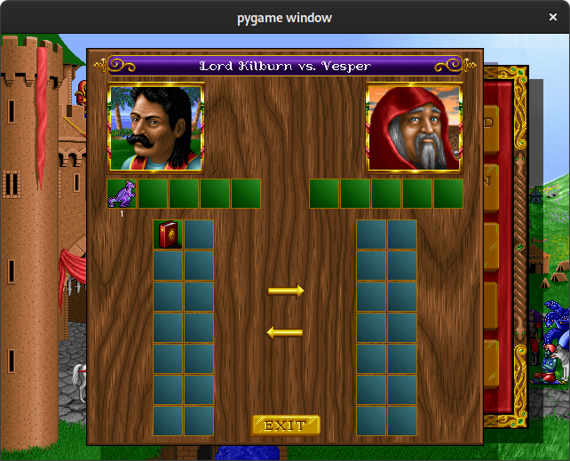

# fhomm

**fhomm** is a Free and Open Source game engine for «Heroes of Might and Magic™».

The goal is to adapt the game to provide modern experience with
quality-of-life improvements, such as higher screen resolution, quicker
navigation, etc.

This project is inspired by and draws heavily from the excellent
[fheroes2](https://github.com/ihhub/fheroes2).

## Status

*Proof-of-concept.*

At the moment I am rapidly prototyping the engine using Python and pygame
(which is backed by SDL).  I chose Python to make it more approachable for
potential contributors (including my own kids), and because it has some
support for live code reloading (but it seems that I am already hitting the
limits here).

This is all preliminary and is likely to change soon.

### What already works

- Loading game assets from the `HEROES.AGG` data file.

  _You still need to buy the Original Game to be able to run **fhomm**!_

- Windows and UI elements such as buttons, labels and item lists.

### What remains to be done

- Everything else. ;)
